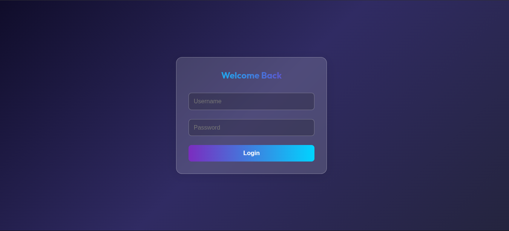

📚 Sistema de Agendamiento de Clases – API .NET 8

API desarrollada en .NET 8 para la gestión de clases y lecciones entre profesores y alumnos. El sistema permite autenticación mediante JWT, visualización de clases disponibles e inscripción a las mismas.

🚀 Características principales

- Autenticación de usuarios con JWT

- Roles de usuario: Profesor y Alumno

- Gestión de clases

- Inscripción de alumnos a clases

- Visualización de clases según rol

- Arquitectura limpia (Clean Architecture)

- Uso de DTOs y buenas prácticas

🛠️ Requisitos técnicos

Antes de ejecutar el proyecto, asegúrate de tener instalado:

- .NET 8 SDK

- Visual Studio / Visual Studio Code

- PostgreSQL (o cuenta en Supabase)

- Git

- Navegador web (para Swagger)

⚙️ Instalación y ejecución
1. Clonar el repositorio

```
git clone https://github.com/Keyner23/assessment.git
cd assessment
```
2. Configurar la base de datos

Crear una base de datos en Supabase (PostgreSQL)

Configurar la cadena de conexión en appsettings.json
```
"ConnectionStrings": {
  "DefaultConnection": "Host=...;Database=...;Username=...;Password=..."
}
```
3. Ejecutar migraciones
```
dotnet ef database update
```
4. Ejecutar el proyecto
```
dotnet run
```
5. Probar la API
```
https://localhost:xxxx/swagger
```

🔐 Autenticación

- El sistema utiliza JWT (JSON Web Tokens):

- Registrar usuario

- Iniciar sesión

- Copiar el token generado

- Usarlo en Swagger con el botón Authorize

📌 Funcionalidades principales
👨‍🏫 Profesor

- Crear clases

- Ver clases creadas

- Ver alumnos inscritos

🎓 Alumno

- Ver clases disponibles

- Inscribirse en clases

- Consultar clases inscritas

🧠 Arquitectura del sistema

El proyecto está organizado bajo Arquitectura Limpia, dividido en:
```
/Domain        → Entidades
/Application   → Lógica de negocio
/Infrastructure→ Acceso a datos
/API           → Controladores
/DTOs          → Transferencia de datos
/Frontend      → Interfaz visual (opcional)
```

📍 Login
```
POST /api/auth/login
```

```
{
  "email": "usuario@email.com",
  "password": "123456"
}
```

🧑‍💻 Manual de usuario
✔️ Requisitos del sistema

- Conexión a internet

- Navegador web

- Acceso a la API (local o desplegada)

▶️ Pasos para usar el sistema

- Ejecutar la API

- Ingresar a Swagger

- Registrar un usuario

- Iniciar sesión

- Copiar el token JWT

- Autorizar en Swagger

- Usar los endpoints según el rol

🧩 Descripción de funcionalidades

- Registro/Login: Permite autenticarse en el sistema

- Gestión de clases: Creación y visualización de clases

- Inscripciones: Los alumnos pueden unirse a clases

- Roles: Diferentes permisos según tipo de usuario





Autor 🚀

Keyner Barrios
Desarrollador Backend en formación 
